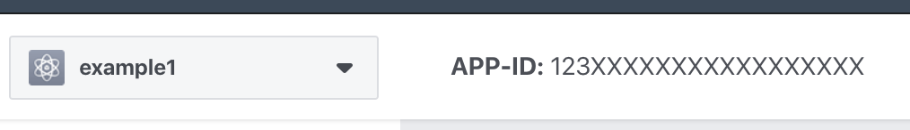
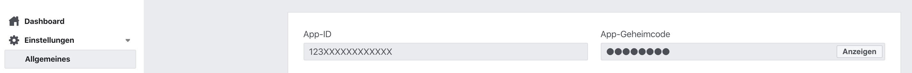

 

# Facebook API + Gitpod.io example

Example project to play with Facebook API and gitpod.io.

## How To:

1. Create config file (`cp config.php.example config.php`)
2. Create a new app (https://developers.facebook.com/apps/)
3. Fetch App ID and App Secret

App ID:

App Secret

3. Generate Access Token (https://developers.facebook.com/tools/explorer/)
4. Update the constants within config.php
5. Reload the browser page on the left
